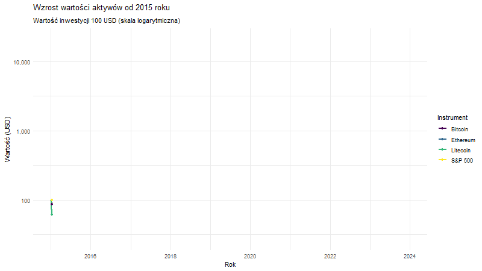

# Analiza Giełdy i Aktywów Cyfrowych 📈🚀

Projekt poświęcony analizie danych giełdowych oraz rynku kryptowalut, wykonany w środowisku **R** przy użyciu nowoczesnych narzędzi raportowania.

 ## Opis projektu
Głównym celem projektu jest analiza trendów, zmienności oraz korelacji między wybranymi instrumentami finansowymi a aktywami cyfrowymi. Raport zawiera czyszczenie danych, wizualizację trendów historycznych oraz wyciąganie wniosków na podstawie wskaźników rynkowych.

##  Wykorzystane technologie
* **Język:** R
* **Narzędzia:** Quarto / RMarkdown
* **Biblioteki:** tidyverse, ggplot2, dygraphs (lub inne użyte w projekcie)
* **Format wyjściowy:** Interaktywny raport HTML

##  Kluczowe wizualizacje
Poniżej znajduje się animacja przedstawiająca dynamikę wzrostu analizowanych aktywów:

 

## 📂 Struktura plików
* `projektP.qmd` / `projektP.rmarkdown` – Pliki źródłowe z kodem analizy.
* `projektP.html` – Pełny, interaktywny raport z wynikami.
* `projektP_files/` – Folder z niezbędnymi zasobami do poprawnego wyświetlania raportu.
* `wykres_wzrostu_final.gif` – Animowana wizualizacja wyników.

## 👤 Autor
**Paweł Zdanowski**
Student Informatyki i Analizy Danych (IAD)
